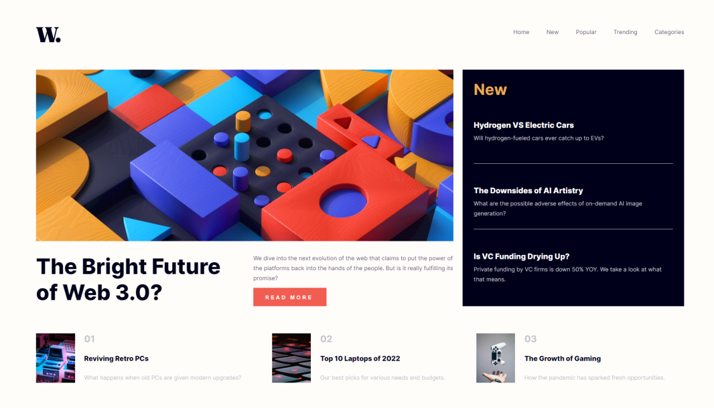

# Frontend Mentor - News homepage solution

This is a solution to the [News homepage challenge on Frontend Mentor](https://www.frontendmentor.io/challenges/news-homepage-H6SWTa1MFl). Frontend Mentor challenges help you improve your coding skills by building realistic projects. 

## Table of contents

- [Overview](#overview)
  - [The challenge](#the-challenge)
  - [Screenshot](#screenshot)
  - [Links](#links)
- [My process](#my-process)
  - [Built with](#built-with)
  - [Continued development](#continued-development)
- [Author](#author)

## Overview

### The challenge

Users should be able to:

- View the optimal layout for the interface depending on their device's screen size
- See hover and focus states for all interactive elements on the page

### Screenshot

### Links

- Solution URL: (https://www.frontendmentor.io/challenges/news-homepage-H6SWTa1MFl/hub)
- Live Site URL: (https://rickrasin.github.io/News-Homepage-Main/)

## My process

First I had made this page using flex and box, but after having done it and I got a little confused in the responsiveness, having seen that the code was too long. I noticed that the entire site could use the CSS grid layout.

So, after that I deleted all the positioning scripts and redid them using the Grid Layout, and it worked.
I confess that I did not think I was capable of such a feat. I'm proud of my result.

### Built with

- Semantic HTML5 markup
- CSS custom properties
- Flexbox
- CSS Grid

### Continued development

Now I'm going to try to make some more complex and bigger pages. As soon as I finish them, I'll go after mastering the use of ReactJS and the API's.

## Author

- Website - [Rickras](https://github.com/Rickrasin/Rickrasin)
- Frontend Mentor - [@Rickrasin](https://www.frontendmentor.io/profile/Rickrasin)
- Twitter - [@ricksoninho](https://www.twitter.com/ricksoninho)
